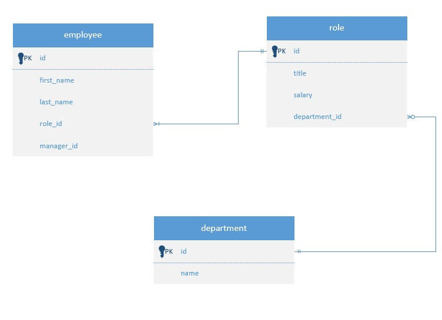

# Employee Tracker

## Description

Employee Tracker application that can be used to manage company's employees using node, MySQ and Inquirer.

## Table of contents

-[Installation](#Installation) -[Usage](#Usage) -[Contribution](#Contribution) -[Questions](#Questions) -[Screenshots](#Screenshots) -[Walkthrough](#Walkthrough)

## Installation

- npm init --y
- npm i
- npm i inquirer@8.2.4
- npm install express mysql2
- npm install console.table --save

## Usage

- npm start

## Contribution

Sumit Ojha

## Questions

- sumit.ojha.dev@gmail.com
- https://github.com/sumitsann

## Screenshots

## Walkthrough
https://www.youtube.com/watch?v=5jvJS4Vpg3Q
